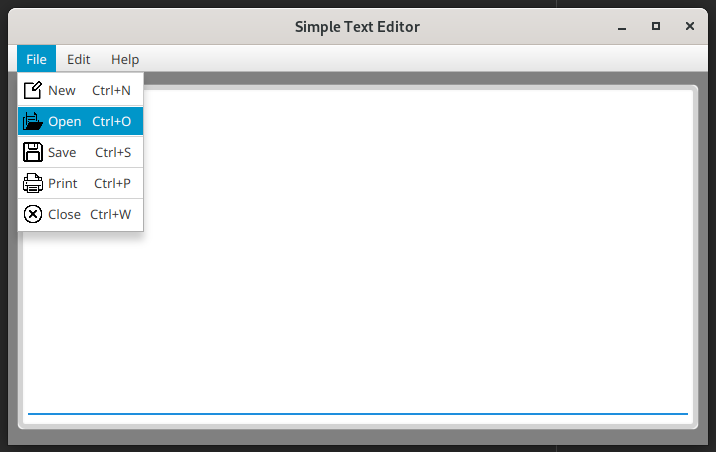

# Simple Text Editor Application 

### A simple Java-FX technology based text editor application

This is a simple text editor that allows you to create and edit text files.
The text files can be saved as regular text files with the **.txt** extension.

#### The main key features as follows,

- It can open any type of plain text file.
- It can save plain text files.
- It has the text files printing facility.
- It has the cut, copy, past and select all, basic text editing options.

The goal of this project was to improve the knowledge of Java-FX, Java, and file handling in Java.

#### Images of the user interfaces
1. Text editor user interface 

2. Text editor splash screen 

3. About window 

## Used Technologies

- Java SE 11
- Apache Maven 3.8.6
- Added dependencies to pom.xml
    - javafx-fxml 18.0.1
    - jfoenix 9.0.1

#### Used Integrated Development Environment
- IntelliJ IDEA

## How to use ?
This project can be used by cloning the 
project to your local computer or running the project jar file.

#### Clone this repository
1. Clone the project using `https://github.com/pasanweerawardana/text-editor` terminal command.
2. Open the `pom.xml` file from **IntelliJ IDEA**, make sure to open this as a project.
3. To run this application execute `mvn javafx:run` goal or create separate maven configuration in **IntelliJ IDEA**.

#### Run JAR file
1. Copy `simple-text-editor.jar` file from the project shade directory.
2. Open terminal from the file copied directory.
3. Execute `java -jar simple-text-editor.jar` command from the terminal.

## Version
v1.0.0

## License
Copyright &copy; 2023 [Pasan Weerawardana](https://www.linkedin.com/in/pasanweerawardana/). All Rights Reserved. 
This project is licensed under the [MIT license](LICENSE.txt).